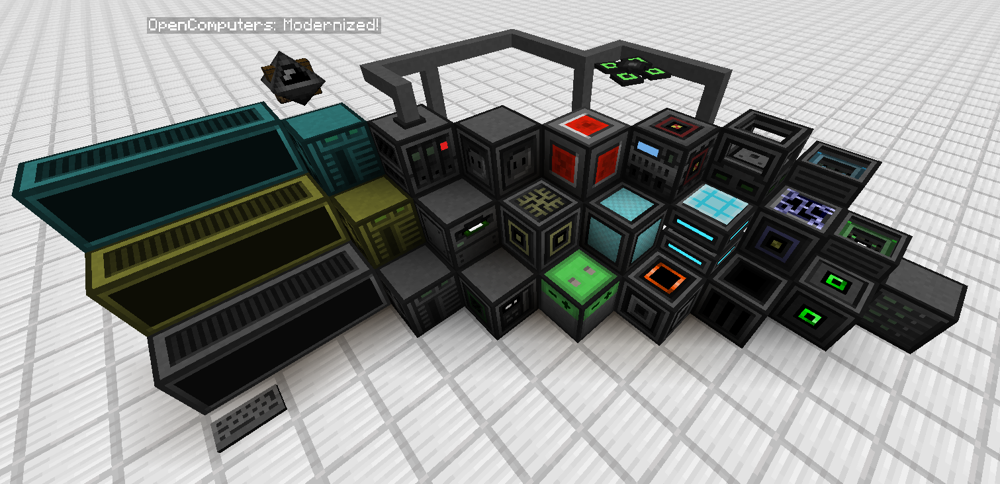

# OpenComputers: Modernized

  

OpenComputers: Modernized (OC:M) is a fork of the original 1.12.2 OpenComputers mod for modern versions of Minecraft, such as 1.21.1 (with more versions to be supported in the future!).

This port is designed to work on both NeoForge and Fabric, so you don't need to leave your favorite mods behind just because they're only available on one of them!

## Features

OC:M is fully feature-complete when compared to the original OpenComputers, thus, you can find everything you remember from the original, for example:
- Modular computers with customizable components
- Customizable drones and robots, which can be made using the assembler
- Loot disks hidden in vanilla structures that contain pre-written programs for your computers and robots
- Extensive support for other mods, so you can use OpenComputers to automate your entire base

## Support

If you run into any issue, first check the ingame "Manual" item, it might just happen to have the answers you're looking for.
If you're still stuck, much of the original OpenComputers wiki is applicable to this version of the mod as well.

Think you've found a bug? Report it on the issue tracker so it can be fixed!:  https://github.com/habzg/OpenComputers-Modernized/issues

## Useful Links
Source code: https://github.com/habzg/OpenComputers-Modernized
OpenComputers Wiki: https://ocdoc.cil.li/
Original OpenComputers source: https://github.com/MightyPirates/OpenComputers
